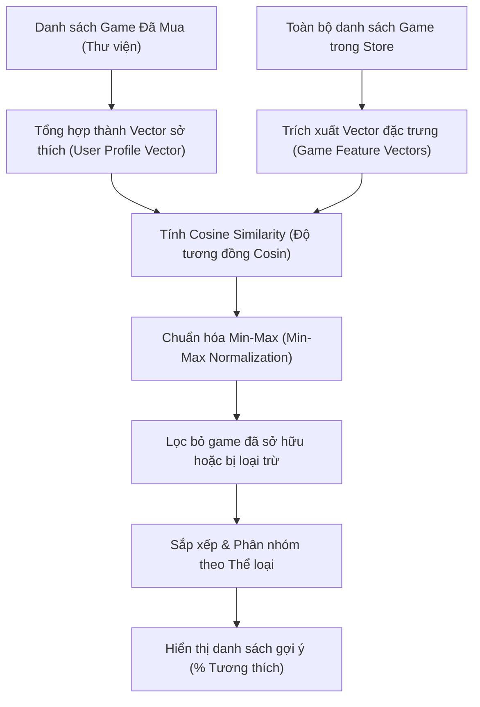

# Hệ thống Gợi ý Game (Recommendation System) trong GamesStore

Tài liệu này giới thiệu về hướng tiếp cận, kiến trúc và các thuật toán được sử dụng để xây dựng hệ thống gợi ý trò chơi trong dự án **GamesStore**.

---

## 📌 1. Tổng quan & Hướng tiếp cận

Hệ thống gợi ý của **GamesStore** sử dụng hướng tiếp cận **Lọc dựa trên nội dung (Content-Based Filtering)** kết hợp với **Độ tương đồng Cosin (Cosine Similarity)**. 

### Tại sao chọn Content-Based Filtering?
- **Không gặp vấn đề "Khởi đầu lạnh" (Cold-start)**: Hệ thống có thể đưa ra gợi ý ngay khi game mới được thêm vào hệ thống, chỉ cần có thông tin thuộc tính (tags, developer...).
- **Cá nhân hóa theo thời gian thực (Real-time)**: Tính toán trực tiếp trên trình duyệt của người dùng (Client-side) dựa vào danh sách game đã mua hoặc tương tác mà không cần gửi dữ liệu cá nhân lên server.
- **Tính giải thích cao (Explainable)**: Dễ dàng chỉ ra lý do tại sao một game được gợi ý cho người dùng (ví dụ: *"Vì bạn đã mua game của Valve"* hoặc *"Cùng thể loại Action"*).

---

## 🏗️ 2. Luồng xử lý của hệ thống

Dưới đây là sơ đồ luồng hoạt động từ thông tin người dùng đến danh sách gợi ý:

---

## 🧮 3. Thuật toán chi tiết

Thuật toán gợi ý được cài đặt hoàn chỉnh trong file [useRecommendations.js](file:///d:/project/GamesStore/frontend/src/hooks/useRecommendations.js).

### Bước 3.1: Xây dựng Vector Đặc trưng có Trọng số (Weighted Feature Vector)

Mỗi game được mô tả bằng một tập hợp các từ khóa (Bag-of-Words) trích xuất từ thuộc tính của nó. Để phản ánh mức độ quan trọng của từng thuộc tính, chúng tôi áp dụng một hệ thống trọng số (Weights):

| Thuộc tính | Trọng số (Weight) | Ý nghĩa |
| :--- | :---: | :--- |
| **Tags** | **5** | Thể loại/Nhãn chi tiết (Action, RPG, Indie...) là yếu tố quyết định lối chơi. |
| **Developer** | **3** | Người chơi thường có xu hướng yêu thích phong cách thiết kế của một nhà phát triển cụ thể (vd: Valve, FromSoftware). |
| **Categories** | **1** | Các chế độ chơi (Single-player, Multi-player, Co-op). |
| **Publisher** | **1** | Hãng phát hành game. |

**Ví dụ:** Game *PUBG* có các thuộc tính:
- Tags: `["Action", "Shooter", "Free To Play"]`
- Developer: `"PUBG Corporation"`
- Categories: `["Multi-player", "Online PvP"]`

Vector đặc trưng của *PUBG* sẽ được biểu diễn:
$$\vec{V}_{\text{PUBG}} = \{ \text{"action"}: 5, \text{"shooter"}: 5, \text{"free to play"}: 5, \text{"pubg corporation"}: 3, \text{"multi-player"}: 1, \text{"online pvp"}: 1 \}$$

---

### Bước 3.2: Tính toán Độ tương đồng Cosin (Cosine Similarity)

Để so sánh mức độ tương quan giữa hai Vector đặc trưng $\vec{A}$ và $\vec{B}$, thuật toán tính toán góc cosin giữa chúng trong không gian đa chiều:

$$\text{Cosine Similarity}(\vec{A}, \vec{B}) = \frac{\vec{A} \cdot \vec{B}}{\|\vec{A}\| \|\vec{B}\|} = \frac{\sum_{i=1}^{n} A_i B_i}{\sqrt{\sum_{i=1}^{n} A_i^2} \times \sqrt{\sum_{i=1}^{n} B_i^2}}$$

- Kết quả trả về nằm trong khoảng $[0, 1]$.
- Giá trị càng gần $1$ thể hiện độ tương thích càng cao.
- Giá trị bằng $0$ nghĩa là hai game không có thuộc tính chung nào.

---

### Bước 3.3: Gợi ý Cá nhân hóa & Chuẩn hóa Điểm số (Personalized & Normalized)

Khi người dùng đã mua nhiều game, hệ thống sẽ gộp toàn bộ các vector game đã mua thành một **Vector sở thích tổng hợp (Profile Vector)**:

$$\vec{V}_{\text{Profile}} = \sum_{g \in \text{Purchased}} \vec{V}_g$$

Sau đó:
1. Tính toán **Cosine Similarity** giữa $\vec{V}_{\text{Profile}}$ và tất cả các game chưa mua trong hệ thống.
2. Áp dụng **Chuẩn hóa Min-Max (Min-Max Normalization)** để chuyển đổi điểm số thô thành phần trăm tương thích $[50\%, 98\%]$ dễ hiểu cho người dùng:

$$\text{Điểm tương thích (\%)} = 50 + \left( \frac{\text{Score} - \text{Score}_{\min}}{\text{Score}_{\max} - \text{Score}_{\min}} \right) \times 45$$

*(Trong đó Scoremax và Scoremin là điểm cao nhất và thấp nhất trong tập kết quả lọc).*

3. **Thuật toán giải thích (Explainable)**: Đối chiếu ngược lại để hiển thị cho người dùng biết game này khớp ở điểm nào (ví dụ: trùng tags gì, trùng nhà phát triển nào...).

---

## 📂 4. Cấu trúc mã nguồn liên quan

Các file trực tiếp tham gia vận hành hệ thống gợi ý:
1. **Lớp xử lý thuật toán chính**: [useRecommendations.js](file:///d:/project/GamesStore/frontend/src/hooks/useRecommendations.js)
   - Hàm `getSimilarGames`: Gợi ý game tương tự trên trang chi tiết game.
   - Hàm `getPersonalizedRecommendations`: Gợi ý cá nhân hóa dựa trên lịch sử mua.
2. **Quản lý dữ liệu người dùng**: [CartProvider.jsx](file:///d:/project/GamesStore/frontend/src/context/CartProvider.jsx)
   - Lưu trữ danh sách game đã mua và các game người dùng muốn loại trừ khỏi danh sách gợi ý (`profileExcluded`).
3. **Trang hiển thị gợi ý**: [Recommendations.jsx](file:///d:/project/GamesStore/frontend/src/pages/Recommendations.jsx)
   - Giao diện trực quan hiển thị danh sách game được gợi ý theo độ tương thích phần trăm giảm dần, phân nhóm theo thể loại chính, và cung cấp nút ẩn/hiện game khỏi profile sở thích.
